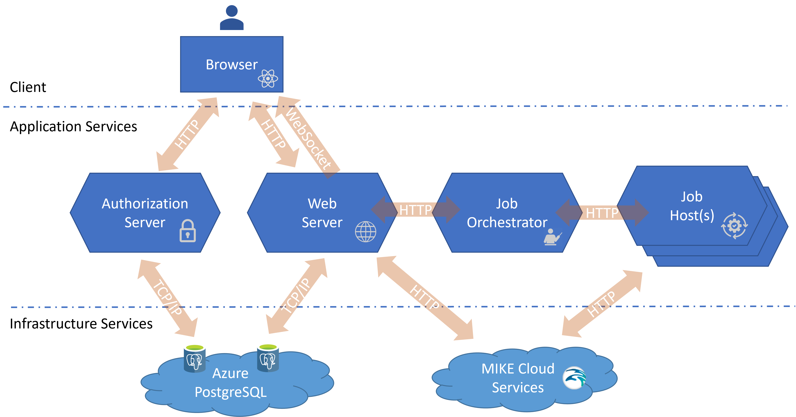
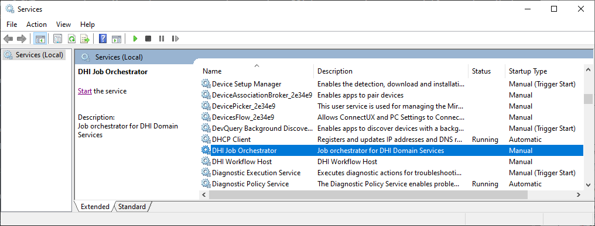
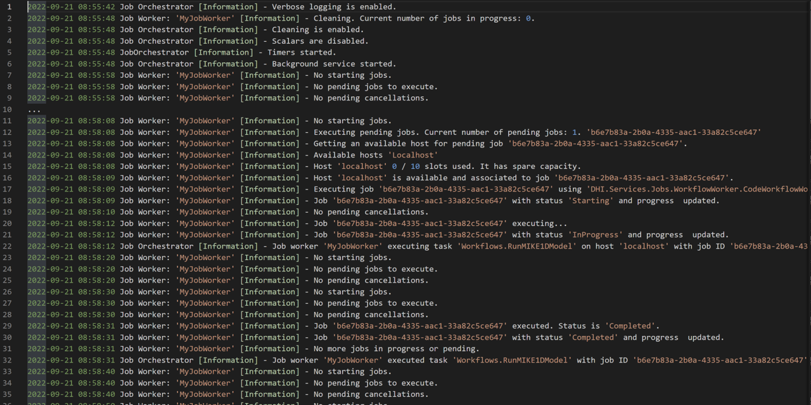
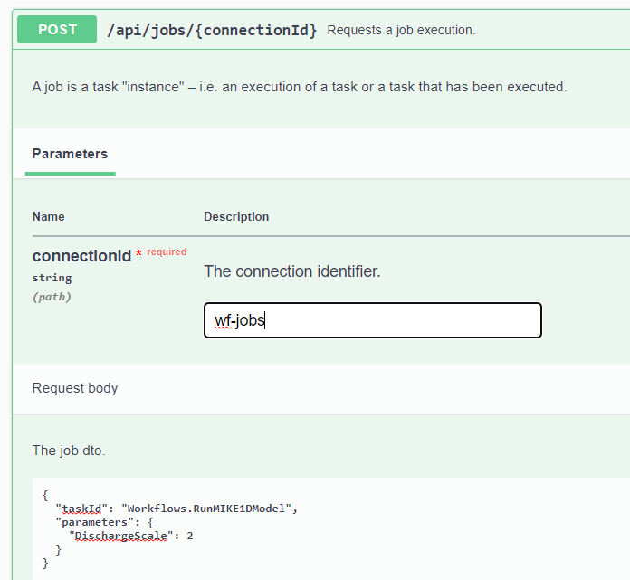

# DHI Domain Services Course Materials
Course materials for a [DHI Domain Services](https://github.com/DHI/DomainServices) course.

[](https://github.com/DHI/DomainServicesCourse/actions/workflows/ci-webapi.yml)
[](https://github.com/DHI/DomainServicesCourse/actions/workflows/ci-authorization.yml)
[](https://github.com/DHI/DomainServicesCourse/actions/workflows/ci-job-orchestrator.yml)
[](https://github.com/DHI/DomainServicesCourse/actions/workflows/main_dsenabler-api.yml)
[](https://github.com/DHI/DomainServicesCourse/actions/workflows/main_dsenabler-auth.yml)

## The Sample Application

The sample application is orchestrating a MIKE 1D model execution workflow and displays the simulation results in a web application. The sample application utilizes cloud infrastructure services from Microsoft Azure (PostrgreSQL) as well as the DHI Cloud Platform (time series storage).



During a course, the Authorization Server and the Web API can be accessed from here:

[Authorization Server - UI](https://dsenabler-auth.azurewebsites.net)

[Authorization Server - Swagger UI](https://dsenabler-auth.azurewebsites.net/swagger/index.html)

[Web API - Swagger UI](https://dsenabler-api.azurewebsites.net/swagger/index.html)

The public signing key for the Authorization Server is:

```
<RSAKeyValue><Modulus>vCweDjcV+X1SnC+M74skba3rH4kcxJLQhOh5b+ylmi5dUd6oerecvY/JOcZn0tVcQd2HVi3Vy3C49TwgOO3YIJPiikO9S7G0OZQYUd37APukl32FoEPCAj/cyb/w2WVLJxF+vdRCsi06y4glPTifVUVkJRNrHTbyDtT8gNc/+qmHvRAnHB9BLV0L4p4KKtBBdrh2Bu9/ubwut4Fn4h3k3P+AAAJjQTO0WtWpl8xaabcaCT4iUdMMpK7f86aDahGAX1CD1E4a/uKSPfIb5uGthL/8e00lCpA5Zf+nUcvaUslE5IlfMH2AGf2841OUSvvT89ma7Ci9WjyP36mxNaZ2nQ==</Modulus><Exponent>AQAB</Exponent></RSAKeyValue>
```

### Running the sample application locally

To set up the sample application to run on you own machine, you have to configure and run the following four services:

#### Authorization Server

The Authorization Server is configured with a PostgreSQL database. You have to create an environment variable called "CoursePostgreSqlConnectionString" with the connection string.

Furthermore, the Authorization Server  uses a pair of RSA signing keys for generation and validation of JWT access tokens. You need to generate and store these RSA keys as environment variables as described in the [documentation](https://dhi-developer-documentation.azurewebsites.net/domain_services/faq/#how-to-create-a-pair-of-rsa-signing-keys-for-generation-and-validation-of-jwt-access-tokens).

> NOTE: It requires a restart to enable new environment variables.

To build and run the Authorization Server in **AuthorizationServer.sln**, use the **BuildAndRun.bat** file. 

#### Web API

The web API is configured with a PostgreSQL database. You have to create an environment variable called "PostgreSqlConnectionString" with the connection string.

> NOTE: It requires a restart to enable new environment variables.

To build and run the Web API in **WebApi.sln**, use the **BuildAndRun.bat** file.

#### Job Orchestrator

Publish the Job Orchestrator in **JobOrchestratorWinService.sln** by running **Publish.bat**.

From the publish folder, run **Install.bat** to install the Job Orchestrator as a Windows Service.

> NOTE: Remember to force administrator privileges.

Once installed, the Job Orchestrator is managed (start/stop) through the standard Windows **Services** application:



> NOTE: The Job Orchestator cannot be successfully started before the [Authorization Server](#authorization-server) and the [Web Server](#web-server) is running.

The Job Orchestrator is configured to log to the **JobOrchestratorWinService.log** file:



#### Job Host

Your own machine will be acting as the job host. The sample application is configured to execute [DHI Workflows](https://github.com/DHI/Workflow#readme) using the [Workflow Host](https://www.nuget.org/packages/DHI.Workflow.Host) package.

Publish the **WorkflowHostWinService** project in **Workflows.sln** by running **Publish.bat**.

From the publish folder, run **Install.bat** to install the Workflow Host as a Windows Service.

> NOTE: Remember to force administrator privileges.

Once installed, the Workflow Host is managed (start/stop) through the standard Windows **Services** application (see above).

### Executing the RunMIKE1DModel workflow

To be able to execute the **RunMIKE1DModel** workflow, you need to have **MIKE+** installed and configured with a valid license.

Open the Swagger UI of the Web API on this URL:

[http://localhost:5000/Swagger/index.html](http://localhost:5000/Swagger/index.html)

Execute the workflow like shown below:




