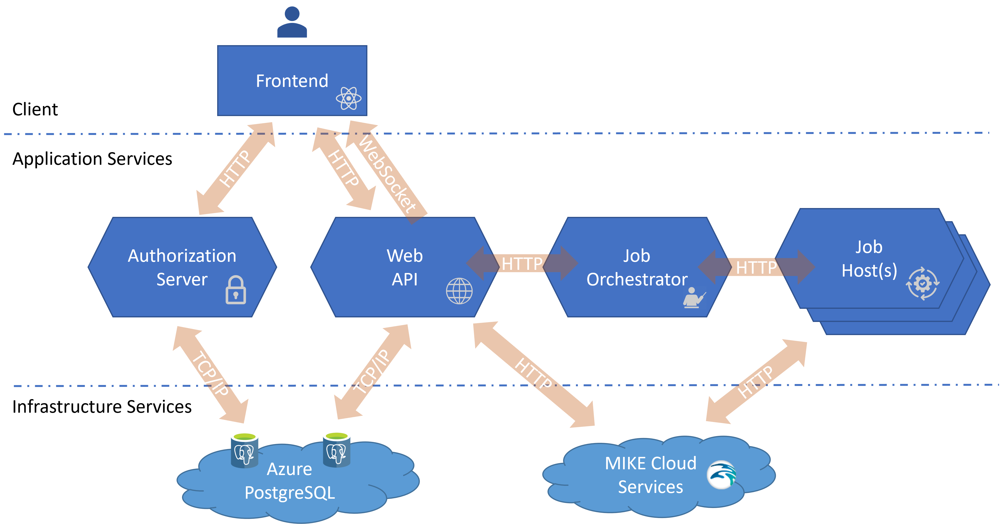

# DHI Domain Services Course Materials
Course materials for a [DHI Domain Services](https://github.com/DHI/DomainServices) course.

## How to Get Started with the Sample Application

To set up the sample application to run on you own machine, you have to configure and run the following four services:

### Authorization Server

The Authorization Server is configured with a PostgreSQL database. You have to create an environment variable called "CoursePostgreSqlConnectionString" with the connection string.

Furthermore, the Authorization Server  uses a pair of RSA signing keys for generation and validation of JWT access tokens. You need to generate and store these RSA keys as environment variables as described in the [documentation](https://dhi-developer-documentation.azurewebsites.net/domain_services/faq/#how-to-create-a-pair-of-rsa-signing-keys-for-generation-and-validation-of-jwt-access-tokens).

> NOTE: It requires a restart to enable new environment variables.

To build and run the Authorization Server in **AuthorizationServer.sln**, use the **BuildAndRun.bat** file. 

### Web Server

The web API is configured with a PostgreSQL database. You have to create an environment variable called "PostgreSqlConnectionString" with the connection string.

> NOTE: It requires a restart to enable new environment variables.

To build and run the Web Server in **WebApi.sln**, use the **BuildAndRun.bat** file.

### Job Orchestrator

Publish the Job Orchestrator in **JobOrchestratorWinService.sln** using the [`dotnet publish`](https://docs.microsoft.com/en-us/dotnet/core/tools/dotnet-publish) command (or use the **Publish...** wizard from within Visual Studio).

From the publish folder, run **Install.bat** to install the Job Orchestrator as a Windows Service.

> NOTE: Remember to force administrator privileges.

Once installed, the Job Orchestrator is managed (start/stop) through the standard Windows **Services** application:

> NOTE: The Job Orchestator cannot be successfully started before the [Authorization Server](#authorization-server) and the [Web Server](#web-server) is running.

The Job Orchestrator is configured to log to the Windows **Event Viewer**:

### Job Host

Your own machine will be acting as the job host. The sample application is configured to execute [DHI Workflows](https://github.com/DHI/Workflow#readme) using the [Workflow Host](https://www.nuget.org/packages/DHI.Workflow.Host) package.

Publish the **WorkflowHostWinService** project in **Workflows.sln** using the [`dotnet publish`](https://docs.microsoft.com/en-us/dotnet/core/tools/dotnet-publish) command (or use the **Publish...** wizard from within Visual Studio).

From the publish folder, run **Install.bat** to install the Workflow Host as a Windows Service.

> NOTE: Remember to force administrator privileges.

Once installed, the Workflow Host is managed (start/stop) through the standard Windows **Services** application (see above).

To be able to execute the **RunMIKE11Model** workflow, you need to have **MIKEZero** installed and configured with a valid licensee.

Furthermore, you have to create a **TransferTimeSeries.xlsx** file in the **DomainServicesCourse\Models\MIKE11**-folder, based on the **TransferTimeSeriesTemplate.xlsx** file, where the `[Root]` placeholder in the **SourceConnection** column is replaced with the actual folder path.

